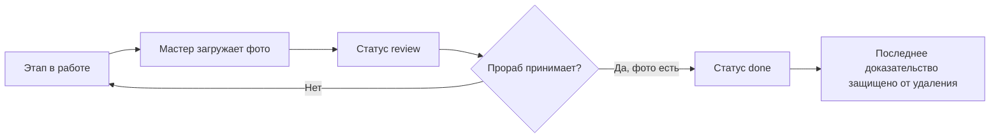

# ADR-002: фундамент DOMMASTER и цифровой технадзор

- Статус: принято частично
- Дата: 2026-07-22
- Источник: архитектурное предложение Lead Backend Engineer

## Решение

Сохраняем рабочую модульную архитектуру SmetaAI на FastAPI, Pydantic и async
SQLAlchemy. Для устанавливаемой desktop-редакции основной БД остается SQLite;
`DATABASE_URL` сохраняет возможность подключить PostgreSQL в будущей серверной
редакции.

Внедряем обязательные бизнес-инварианты предложения:

1. `User` представляет только сотрудника, `Client` — только заказчика.
2. Новый этап нельзя создать уже принятым или завершенным.
3. Фото этапа автоматически переводит его в `review`.
4. Завершение разрешено только из `review` и только при наличии фото.
5. Последнее фото завершенного этапа удалить нельзя.
6. Роли и статусы определяются доменными Enum, а бизнес-правила находятся в
   сервисе, не в HTTP-обработчике.

## Почему не переносим всё на SQLModel/PostgreSQL сейчас

Полная замена ORM не добавляет бизнес-возможностей, но требует переписать и
повторно проверить рабочие модели, миграции, 93 backend-теста и упаковку.
Обязательный PostgreSQL лишит desktop-продукт автономной установки: клиенту
понадобится отдельный сервер и его обслуживание.

SQLite выбран для локальной редакции как однопользовательское хранилище с
транзакционной согласованностью и работой без сети. CAP здесь неприменима как к
распределенному кластеру: сетевого разделения между узлами нет. PostgreSQL нужен
для будущей многопользовательской cloud/LAN-редакции, где централизованная
согласованность важнее автономной доступности каждого клиента при разрыве сети.

## Совместимость

Существующие API-значения `not_started`, `in_progress`, `done`, `delayed`
сохранены; добавлен `review`. Это исключает разрушительную миграцию установленных
SQLite-баз и сохраняет совместимость интерфейса. Переход integer ID → UUID и
Alembic следует выполнять отдельной версионированной миграцией только перед
публичной серверной редакцией.

## Поток приемки

## Проверка

- `backend/tests/crm/test_stage_supervision.py`
- полный backend-набор: `93 passed`
- production frontend build: успешно
